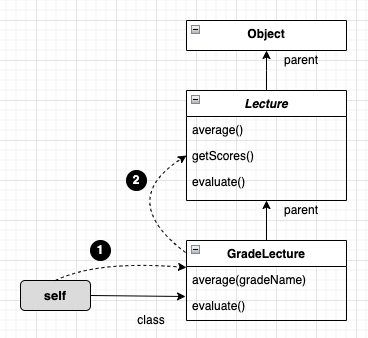
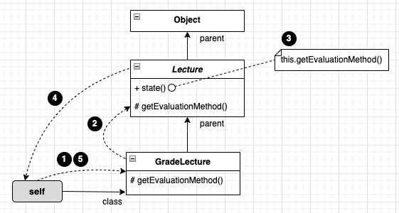

# 다형성

상속의 목적은 코드 재사용이 아닌, 타입 계층을 구조화하기 위해 사용해야 한다. 
타입 계층은 객체지향 프로그래밍의 다형성의 기반을 제공한다.  
<br/>
<br/>

## 다형성

다형성(Polymorphism) '많은 형태를 가질 수 있는 능력'으로, 컴퓨터 과학에서는 하나의 추상 인터페이스에 대해 코드를 작성하고 이 추상 인터페이스에 대해 서로 다른 구현을 연결할 수 있는 능력으로 정의한다.  
다형성은 여러 타입을 대상으로 동작할 수 있는 코드를 작성할 수 있는 방법이다.  

다형성은 유니버설 다형성(매개변수 다형성, 포함 다형성)과 임시 다형성(오버로딩 다형성, 강제 다형성)으로 분류할 수 있다.  

하나의 클래스 안에 동일한 이름의 메서드가 존재하는 경우를 오버로딩 다형성이라고 부른다.  

강제 다형성은 언어가 지원하는 자동적인 타입 변환이나 사용자가 직접 구현한 타입 변환을 이용해 동일한 연산자를 다양한 타입에 사용할 수 있는 방식을 가리킨다.  
예를 들어 이항 연산자인 '+'는 모두 정수이면 덧셈 연산자로 동작하고, 정수와 문자열인 경우 연결 연산자로 동작한다. 이 때 피연산자는 문자열로 강제 형변환된다.  

매개변수 다형성은 제네릭 프로그래밍과 관련이 높은데 클래스의 인스턴스 변수나 메서드의 매개변수 타입을 임의의 타입으로 선언한 후 사용하는 시점에 구체적인 타입으로 지정하는 방식을 가리킨다.  

포함 다형성은 메시지가 동일하더라도 수신한 객체의 타입에 따라 실제로 수횅되는 행동이 달리지는 능력을 의미한다. 서브 타입 다형성이라고도 부른다.  
디향성이라고할 때는 포함 다형성을 의미하는 것이 일반적이다.

```java
public class Movie {
    private DiscountPolicy discountPolicy;
}
```  
<br/>

포함 다형성을 사용하는 일반적인 방법은 두 클래스를 상속 관계로 연결하여 자식 클래스에서 부모 클래스의 메서드를 오버라이딩 한 후 클라이언트는 부모 클래스만 참조하면 구현할 수 있다.  

포함 다형성을 위한 전재조건은 자식 클래스가 부모 클래스의 서브타입이어야 한다는 것이다.  
그리고 상속의 진정한 목적은 코드 재사용이 아니라 다형성을 위한 서브타입 계층을 구축하는 것이다.  

포함 다형성을 위해 상속을 사용하는 가장 큰 이유는 상속이 클래스들을 계층으로 쌓아 올린 후 상황에 따라 적절한 메서드를 선택할 수 있는 메커니즘을 제공하기 때문이다.  
객체가 메시지를 수신하면 객체지향 시스템은 메시지를 처리할 적절한 메서드를 상속 계층  안에서 탐색한다.  
<br/>
<br/>

## 상속의 양면성
객체지향 패러다임의 근간을 이루는 아이디어는 데이터와 행동을 객체라 불리는 하나의 실행 단위 안으로 통합하는 것으로, 항상 데이터(필드)와 행동(메서드)이라는 두 가지 관점을 함께 고려해야 한다.  

상속은 프로그램을 구성하느 ㄴ개념들을 기반으로 다형성을 가능하게 하는 타입 계층을 구축하기 위한 것이다.  
<br/>

### 상속을 사용한 강의 평가 (step01)
Pass와 Fail은 강의를 이수한 학생과 낙제한 학생을 나타낸다.  

GradeLecture클래스는 Grade 클래스를 상속받아 등급까지 표시할 수 있다.  

GradeLecture와 Lecture에 구현된 두 evaluate 메서드의 시그니처가 동일하다는 것을 주목하자.  
부모와 자식 클래스에 동일한 시그니처를 가진 메서드가 존재할 경우 자식 클래스의 메서드 우선순위가 더 높다.  

자식 클래스 안에 상속받은 메서드와 동일한 시그니처의 메서드를 재정의해서 부모 클래스의 구현을 새로운 구현으로 대체하는 것을 메서드 오버라이딩이라고 부른다.  

부모 클래스에서 정의한 메서드와 이름은 동일하지만 시그니처는 다른 메서드를 자식 클래스에 추가하는 것을 메서드 오버로딩이라고 부른다.  
<br/>

### 데이터 관점의 상속
데이터 관점에서 상속은 자식 클래스의 인스턴스 안에 부모 클래스의 인스턴스를 포함하는 것으로 볼 수 있다.  
따라서 자식 클래스의 인스턴스는 자동으로 부모 클래스에서 정의한 모든 인스턴스 변수를 포함할 수 있다.  
<br/>

## 행동 관점의 상속
행동 관점의 상속은 부모 클래스가 정의한 일부 메서드를 자식 클래스의 메서드로 포함시키는 것을 의미한다.  

부모 클래스에 정의된 어떤 메서드가 자식 클래스에 포함될지는 언어의 종류와 각 언어가 정의하는 접근 제어자의 의미에 따라 다르지만 공통적으로 부모 클래스의 모든 퍼블릭 메서드는 자식 클래스의 퍼블릭 인터페이스에 포함된다.  
부모 클래스의 인스턴스에게 전송할 수 있는 모든 메시지는 자식 클래스의 인스턴스에게도 전송할 수 있다.  

부모 클래스에서 구현한 메서드를 자식 클래스에서 사용할 수 있는 이유는 런타임에 시스템이 자식 클래스에 정의되지 않은 메서드가 있을 경우 이 메서드를 부모 클래스 안에서 탐색하기 때문이다.  

행동 관점에서 다형성의 기본적인 개념을 이해하기 위해서는 상속 관계로 연결된 클래스 사이의 메서드 탐색 과정을 이해하는 것이 가장 중요하다.  

객체의 경우 서로 다른 상태를 저장할 수 있도록 각 인스턴스별로 독립적인 메모리를 할당받아야 한다.  
하지만 메서드는 동일한 클래스의 인스턴스끼리 공유가 가능하기 때문에 클래스는 한 번만 메모리에 로드하고 각 인스턴스별로 클래스를 가리키는 포인터를 갖게 하는 것이 경제적이다.  
<br/>

## 업캐스팅과 동적 바인딩 (step02)

### 같은 메시지, 다른 메서드
코드 안에서 선언된 참조 타입과 무관하게 실제로 메시지를 수신하는 객체의 타입에 따라 실행되는 메서드가 달라질 수 있는 것은 업캐스팅과 동적 바인딩이라는 매커니즘이 작용하기 때문이다.  

부모 클래스 타입으로 선언된 변수에 자식 클래스의 인스턴스를 할당하는 것을 업캐스팅이라고 한다.  

선언된 변수의 타입이 아니라 메시지를 수신하는 객체의 타입에 따라 실행되는 메서드가 결정된다. 
이것은 객체지향 시스템이 메시지를 처리할 적절한 메서드를 컴파일 시점이 아니라 실행 시점에 결정하기 때문에 가능한데, 이를 동적 바인딩이라고 부른다.  
<br/>

### 업캐스팅
모든 객체지향 언어는 명시적으로 타입을 변환하지 않고도 부모 클래스 타입의 참조 변수에 자식 클래스의 인스턴스를 대입할 수 있게 허용한다.  

```java
Lecture lecture = new GradeLecture();
GradeLecture gradeLecture = (GradeLecture) lecture;
```
<br/>

반대로 부모 클래스의 인스턴스를 자식 클래스 타입으로 변환하기 위해서는 명시적인 타입 캐스팅이 필요한데 이를 다운 캐스팅이라고 부른다.  

컴파일러의 관점에서 자식 클래스는 아무런 제약 없이 부모 클래스를 대체할 수 있기 때문에 부모 클래스와 협력하는 클라이언트는 다양한 자식 클래스의 인스턴스와도 협력하는 것이 가능하다.  
<br/>

### 동적 바인딩
함수를 호출하는 전통적인 언어들은 호출될 함수를 컴파일타임에 결정한다.  
이러한 방식을 정적 바인딩, 초기 바인딩, 컴파일타임 바인딩이라고 부른다.  

객체지향 언어에서는 메시지를 수신했을 때 실행될 메서드가 런타임에 결정된다.  
이러한 방식을 동적 바인딩 또는 지연 바인딩이라고 부른다.  
<br/>
<br/>

## 동적 메서드 탐색과 다형성
객체지향 시스템은 다음 규칙에 따라 실행할 메서드를 선택한다.  

1) 메시지를 수신한 객체는 먼저 자신을 생성한 클래스에 적합한 메서드가 존재하는지 검사한다. 존재하면 메서드를 실행하고 탐색을 종료한다.  
2) 메서드를 찾지 못했다면 부모 클래스에서 메서드 탐색을 계속한다. 이 과정은 적합한 메서드를 찾을때까지 상속 계층을 따라 올라가며 계속된다.  
3) 상속 계층의 가장 최상위 클래스에 이르렀지만 메서드를 발견하지 못한 경우 예외를 발생시키며 탐색을 중단한다.  
<br/>

메시지 탐색에는 중요한 변수가 있는데 self 참조다.  
객체가 메시지를 수신하면 컴파일러는 self 참조라는 임시 변수를 자동으로 생성한 후 메시지를 수신한 객체를 가리키도록 설정한다.  
동적 메서드 탐색은 self가 가리키는 객체의 클래스에서 시작해서 상속 계층의 역방향으로 이뤄지며 메서드 탐색이 종료되는 순간 self 참조는 종료된다.  

메서드 탐색은 자식 클래스에서 부모 클래스 방향으로 진행된다.  
항상 자식 클래스의 메서드가 부모 클래스의 메서드보다 먼저 탐색되기 때문에 자식 클래스에 선언된 메서드가 부모 클래스의 메서드보다 더 높은 우선순위를 가지게 된다.  

#### 종적 메서드 탐색이 구성되는 두가지 원리
- 자동적인 메시지 위임: 자식 클래스에서 부모 클래스로 처리 위임
- 메시지를 탐색하기 위해 동적인 문맥을 사용: 메시지를 수신했을 때, 메서드의 실행은 런타임 시점에 이뤄지며, 메서드를 탐색하는 경로는 self 참조를 이용해서 결정한다.  
<br/>

메시지가 처리되는 문맥을 이해하기 위해서는 정적인 코드 분석만이 아닌 런타임에 실제로 메시지를 수신한 객체가 어떤 타입인지를 추적해야 한다.  
<br/>

### 자동적인 메시지 위임
동적 메서드 탐색의 입장에서 상속 계층은 메시지를 수신한 객체가 자신이 이해할 수 없는 메시지를 부모 클래스에게 전달하기 위한 물리적인 경로를 정의하는 것을 볼 수 있다.  
상속 계층 안의 클래스는 메시지를 처리할 방법을 알지 못할 경우 적절한 메세지를 찾을 때까지 메시지에 대한 처리를 부모 클래스에게 위임한다.  

상속을 이용할 경우 메시지 위임과 관련된 코드를 명시적으로 작성할 필요가 없음에 주목하라.  
메시지는 상속 계층을 따라 부모 클래스에게 자동으로 위임되며, 이런 관점에서 상속 계층을 정의하는 것은 메서드 탐색 경로를 정의하는 것과 같다.  
<br/>


<br/>

### 동적인 문맥
동일한 코드라고 해도 self 참조가 가리키는 객체가 무엇인지에 따라 메서드 탐색을 위한 상속 계층의 범위가 동적으로 변한다.  
따라서 self 참조가 가리키는 객체의 타입을 변경함으로써 객체가 실행될 문맥을 동적으로 바꿀 수 있다.  

self 참조가 동적 문맥을 결정한다는 사실은 종종 어떤 메서드가 실행될지를 예상하기 어렵게 만든다.  
대표적인 경우가 자신에게 다시 메시지를 전송하는 self 전송이다.  

```java
public class Lecture {
    // 평가 기준에 대한 정보를 반환
    public String stats() {
        return String.format("Title: %s, Evaluation Method: %s", title, getEvaluationMethod());
    }

    private String getEvaluationMethod() {
        return "Pass or Fail";
    }
}
```
<br/>

위 코드에서 Lecture가 자신의 getEvaluationMethod를 호출하는 것이 아닌 현재 객체에게 매시지를 전송하는 것이다.  

현재 객체란 self 참조가 가리키는 객체다.  
이처럼 self 참조가 가리키는 자기 자신에게 메시지를 전송하는 것을 self 전송이라고 부른다.  
self 전송은 self 참조가 가리키는 바로 그 객체에서부터 메시지 탐색을 시작한다는 사실을 기억해야 한다.  

self 전송은 자식 클래스에서 부모 클래스 방향으로 진행되는 동적 메서드 탐색 경로를 다시 self 참조한다.  
이로 인해 최악의 경우에는 실제로 실행될 메서드를 이해하기 위해 상속 계층 전체를 훑어가며 코드를 이해해야 하는 상황이 발생할 수도 있다.  
<br/>


<br/>

### 이해할 수 없는 메시지
클래스는 자신이 처리할 수 없는 메시지를 수신하면 부모 클래스로 처리를 위임한다.   
이애할 수 없는 메시지를 처리하는 방법은 프로그래밍 언어가 정적 타입 언어에 속하는지, 동적 타입 언어에 속하는지에 따라 달라진다.  
<br/>

#### 정적 타입 언어와 이해할 수 없는 메시지  
정적 타입 언어는 코드를 컴파일할 때 상속 계층 안의 클래스들이 메시지를 이해할 수 있는지 여부를 판단한다.  
따라서 상속 계층 전체를 탐색한 후에도 메시지를 처리할 수 있는 메서드를 발견하지 못했다면 컴파일 에러를 발생시킨다.  
<br/>

#### 동적 타입 언어와 이해할 수 없는 메시지  
동적 타입 언어도 메시지를 수신한 객체의 클래스로부터 부모 클래스의 방향으로 메서드를 탐색한다.  
동적 타입 언어에는 컴파일 단계가 존재하지 않기 때문에 실제로 코드를 실행해보기 전에는 메시지 처리 가능 여부를 판단할 수 없다.  
최상위 클래스까지 메시지를 탐 후 메시지를 찾지 못했을 때 doesNotUnderstand 메시지나 예외를 던진다.  

동적 타입 언어에서는 이해할 수 없는 메시지에 대해 예외를 던지는 것 외에도 선택할 수 있는 방법이 하나 더 있다.  
doesNotUnderstand에 응답할 수 있는 메서드를 구현하는 것이다. 
이 경우 객체는 자신의 인터페이스에 정의되지 않는 메시지를 처리하는 것이 가능해진다.  
하지만 이런 특성은 코드를 이해하고 수정하기 어렵게 만들고 디버깅 과정을 복잡하게 만들기도 한다.  

정적 타입 언어는 컴파일 시점에 수신 가능한 메시지를 채크하기 때문에 이해할 수 없는 메시지를 처리할 수 있는 유연성은 잃게 되지만 실행 시점에 오류가 발생할 가능성을 줄임으로써 프로그램이 좀 더 안정적으로 실행될 수 있다.  
<br>

### self 대 super
self 참조의 가장 큰 특징은 동적이라는 점이다. 메시지를 수신한 객체의 클래스에 따라 메서드 탑색을 위한 문맥을 실행 시점에 결정한다.  

객체지향의 언어들은 클래스에서 부모 클래스의 인스턴스 변수나 메서드에 접근하기 위해 사용할 수 있는 super 참조라는 내부 변수를 제공한다.  

```java
public class FormattedGradeLecture extends GradeLecture {
    public FormattedGradeLecture(int pass, String title, List<Integer> scores, List<Grade> grades) {
        super(pass, title, scores, grades);
    }

    public String formatAverage() {
        return String.format("Avg: %1.1f", super.average());
    }
}
```
super는 부모 클래스에게 메시지를 전송한다. 호출하는 것이 아니다.  

super가 부모 클래스의 메서드를 호출하는 것이라면 위 코드는 정상적으로 실행될 수 없을 것이다.  
부모 클래스인 GradeLecture에는 average 메서드가 정의돼 있지 않기 때문이다.  

부모 클래스의 메서드를 호출한다는 것은 그 메서드가 반드시 부모 클래스 안에 정의돼 있어야 한다는 것을 의미한다.  
부모 클래스에서 메서드 탐색을 시작한다는 것은 그 클래스의 조상 어딘가에 그 메서드가 정의돼 있기만 하면 실행할 수 있다는 것을 의미한다.  

super 참조를 통해 메시지를 전송하는 것은 마치 부모 클래스의 인스턴스에게 메시지를 전송하는 것처럼 보이기 때문에 super 전송이라고 부른다.  

self 전송은 메시지를 수신하는 객체의 클래스에 따라 메서드를 탐색할 시작 위치를 동적으로 결정하는 데(런타임), super 전송은 항상 메시지를 전송하는 클래스의 부모 클래스에서부터 시작된다.(컴파일타임)  
<br/>
<br/>

## 상속 대 위임
다형성은 self 참조가 가리키는 현재 객체에게 메시지를 전달하는 특성을 기반으로 한다.  
동일한 타입의 객체 참조에게 동일한 메시지를 전송하더라도 self 참조가 가리키는 객체의 클래스가 무엇이냐에 따라 메서드 탐색을 위한 문맥이 달라진다.  
<br/>

### 위임과 self 참조
자신이 수신한 메시지를 다른 객체에게 동일하게 전달해서 처리를 요청하는 것을 위임이라고 한다.  

위임은 본질적으로는 자신이 정의하지 않거나 처리할 수 없는 속성 또는 메서드의 탐색 과정을 다른 객체로 이동시키기 위해 사용한다.  
이를 위해 위임은 항상 현재의 실행 문맥을 가리키는 self 참조를 인자로 전달한다.  

객체가 다른 객체에게 요청을 처리할 때 인자로 self를 전달하지 않을 수도 있다. 
이것은 요청을 전달받는 최초의 객체에 다시 메시지를 전송할 필요는 없고 단순히 코드를 재사용하고 싶은 경우라고 할 수 있다.  
이처럼 처리를 요청할 때 self 참조를 전달하지 않는 경우를 포워딩이라고 한다. 
이와 달리 self 참조를 전달하는 경우에는 위임이라고 부른다.  
위임의 정확한 용도는 클래스를 이용한 상속 관계를 객체 사이의 합성 관계로 대처해서 다형성을 구현하는 것이다.  

상속은 동적으로 메서드를 탐색하기 위해 현재의 실행 문맥을 가지고 있는 self참조를 전달한다.  
그리고 이 객체들 사이에서 메시지를 전달하는 과정은 자동으로 이뤄진다. 따라서 자동적인 메시지 위임이라고 부르는 것이다.  
<br/>

### 프로토타입 기반의 객체지향 언어  
클래스가 존재하지 않고 오직 객체만 존재하는 프로토타입 기반의 객체지향 언어에서 상속을 구현하는 유일한 방법은 객체 사이의 위임을 이용하는 것이다.  

```javascript
function Lecture(name, scores) {
    this.name = name;
    this.scores = scores;
}

Lecture.prototype.stats = function() { 
    return "Name: " + this.name + ", Evaluation Method: " + this.getEvaluationMethod();
}

Lecture.prototype.getEvaluationMethod = function() {
    return "Pass or Fail";
}
```
<br/>

메서드를 Lecture의 prototype이 참조하는 객체에 정의했다는 점에 주목하라.  
특별한 작업을 하지 않는 한 prototype에 할당되는 객체는 자바스크립트의 최상위 객체 타입인 Object다.  
따라서 Lecture를 이용해서 생성되는 모든 객체들은 prototype이 참조하는 Object에 정의된 모든 속성과 메서드를 상속받는다.  

```javascript
function GradeLecture(name, canceled, scores) {
    Lecture.call(this, name, scores)
    this.canceled = canceled;
}

GradeLecture.prototype = new Lecture();

GradeLecture.prototype.constructor = GradeLecture;

GradeLecture.prototype.getEvaluationMethod = function() {
    return "Grade";
}
```
<br/>

GradeLecture의 prototype에 Lecture의 인스턴스를 할당했다는 것에 주목하라.  
이 과정을 통해 GradeLecture를 이용해 생성된 모든 객체들이 prototype을 통해 Lecture에 정의된 모든 속성과 함수에 접근할 수 있게 된다.  
결과적으로 GradeLecture의 모든 인스턴스들은 Lecture의 특성을 자도ㅓㅇ으로 상속 받게 된다.  
이제 메시지를 전송하면 prototype으로 연결된 객체 사이의 경로를 통해 객체 사이의 메서드 탐색이 자동으로 이뤄진다.  

```javascript
let grade_lecture = new GradeLecture("OOP", false, [1 ,2 ,3]);
grade_lecture.stats();
```
<br/>

자바스크립트는 prototype으로 연결된 객체들의 체인을 거슬러 올라가며 자동적으로 메시지에 대한 위임을 처리한다.  

자바스크립트에는 클래스가 존재하지 않기 때문에 오직 객체들 사이의 메시지 위임만을 이용해 다형성을 구현한다.  
이는 객체지향 패러다임에서 클래스가 필수 요소가 아니라는 점을 잘 보여준다.  
또한 상속 이외의 방법으로도 다형성을 구현할 수 있다는 사실을 보여준다.  

객체지향은 객체를 지향하는 것이다. 
클래스는 객체를 편리하게 정의하고 생성하기 위해 제공되는 프로그래밍 구성 요소일 뿐이며 중요한 것은 메시지와 협력이다.  
클래스 없이도 객체 사이의 협력 관계를 구축하는 것이 가능하며 상속 없이도 다형성을 구현하는 것이 가능하다.  
<br/>

